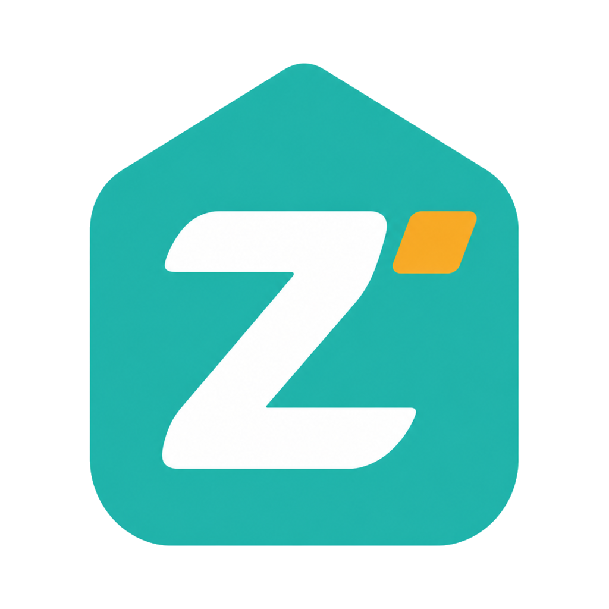

<p align="center">
  
</p>

<h1 align="center">ZPan</h1>

<p align="center">
  <strong>S3 互換ストレージのためのオープンソースなファイルホスティング。</strong>
</p>

<p align="center">
  Cloudflare Workers または Docker にデプロイ。オブジェクトストレージへ直接アップロード。
</p>

<p align="center">
  <a href="https://github.com/saltbo/zpan/actions/workflows/ci.yml"></a>
  <a href="https://codecov.io/gh/saltbo/zpan"></a>
  <a href="https://github.com/saltbo/zpan/actions/workflows/release.yml"></a>
  <a href="https://github.com/saltbo/zpan/releases/latest"></a>
  <a href="https://ghcr.io/saltbo/zpan"></a>
  <a href="https://github.com/saltbo/zpan/blob/main/LICENSE"></a>
</p>

<p align="center">
  <a href="../../README.md">English</a> ·
  <a href="README.zh-CN.md">简体中文</a> ·
  <strong>日本語</strong> ·
  <a href="README.ko.md">한국어</a> ·
  <a href="README.ru.md">Русский</a> ·
  <a href="README.es.md">Español</a> ·
  <a href="README.pt-BR.md">Português (BR)</a>
</p>

## ZPan とは？

ZPan は、S3 互換ストレージの上に構築された軽量なファイルホスティングプラットフォームです。ファイルは presigned URL を通じてクライアントから S3 へ直接アップロードされ、サーバーの帯域幅を完全に経由しません。サーバーはコントロールプレーンとして、認証、メタデータ、共有、クォータ、チーム、WebDAV、ツール連携、管理操作を担います。

製品としての境界は意図的に定めています。ZPan は S3 をバックエンドとする目的特化型のウェブドライブであり、あらゆるコンシューマー向けクラウドドライブをラップするものでも、フル機能のグループウェアスイートでもありません。あなたが S3 互換バケットを用意すれば、ZPan はそこに洗練されたウェブ UI、公開共有、画像ホスティング API、そして VPS や NAS を必要としないデプロイ手段を提供します。

**主なユースケース：**

- **S3 ウェブドライブ** — 自分のオブジェクトストレージ上で、ファイル、フォルダ、プレビュー、ゴミ箱、クォータ、チームワークスペースを管理
- **画像ホスティング** — PicGo、PicList、uPic、ShareX、Flameshot、または API 経由でアップロードし、安定した URL を即座に取得
- **ファイル共有** — パスワード、有効期限、ダウンロード回数制限、ダイレクトリンク、ドライブへの保存フローを備えた共有リンクを公開
- **個人ホームページ** — 各ユーザーに、厳選した共有ファイルとフォルダ形式のブラウジングが可能な公開ページ `/u/username` を提供
- **外部アクセス** — WebDAV 経由でファイルをマウントし、リモートダウンロードワークフロー向けにダウンローダーワーカーを実行

## なぜ ZPan なのか？

**設計として S3 のみ。** ZPan はあらゆるネットディスクプロバイダーを追いかけたり、クラウドドライブのネスト層を構築したりはしません。ストレージの契約はシンプルで永続的なものに保たれます。Cloudflare R2、AWS S3、Backblaze B2、MinIO、RustFS、Tigris、その他の S3 互換サービスといった S3 互換バケットです。

**Cloudflare Workers ファースト。** ZPan は Cloudflare Workers、D1、Hono、そして Web 標準 API を中心に構築されており、Docker やその他のランタイムを追加のデプロイ先としています。VPS を所有したり、NAS を稼働させ続けたり、長時間稼働するサーバーを介してアップロードをプロキシしたりすることなく、本格的なファイルホスティングのコントロールプレーンを運用できます。

**ダイレクトな転送経路。** アップロードとダウンロードは可能な限り presigned なオブジェクトストレージ URL を使用します。これによりサーバーの帯域幅を抑え、中央集約的なファイル転送のボトルネックを回避し、重い処理をオブジェクトストレージに任せられます。

**実用的なファイルワークフロー。** ZPan は、ウェブファイルマネージャー、公開共有、画像ホスティング設定、API キー、WebDAV アクセス、チーム、クォータ、リモートダウンロードタスク、ファイルプレビュー、管理コントロールを備えており、プロバイダー集約型プラットフォームへと変貌することはありません。

**デプロイ可能なダウンローダーワーカー。** リモートダウンロードは、必ずしも ZPan 本体のインスタンス内で実行する必要はありません。シンプルな構成のために ZPan と一緒にダウンローダーをデプロイすることも、ネットワークアクセスが良好でソースサイトの制限が少ない環境に別途配置することもでき、その後 ZPan に完了したファイルをオブジェクトストレージへ取り込ませることができます。

## 製品の境界

ZPan は次のようなニーズに適しています：

- ストレージプロバイダーの寄せ集めではなく、S3 をバックエンドとする目的特化型のウェブドライブが欲しい
- 自分自身のバケットを使った、セルフホスト型の画像ベッドとファイル共有アプリが欲しい
- VPS や NAS を維持せずに Cloudflare ネイティブなデプロイがしたい
- アプリサーバーによるファイルプロキシではなく、ブラウザから S3 への転送がしたい
- スクリーンショット、公開、WebDAV、リモートダウンロード、API 駆動ワークフローのためのツール連携が欲しい

ZPan が目指していないもの：

- Nextcloud Office のようなリアルタイムドキュメント共同編集スイート
- AList のような汎用クラウドドライブアグリゲーター
- File Browser のようなローカルサーバーディレクトリブラウザ

## ZPan の比較

ほとんどのセルフホスト型ファイルプロジェクトは、サーバーファイル、デスクトップ同期、コラボレーション、あるいは多数のプロバイダー集約のいずれかから出発します。ZPan は S3 互換オブジェクトストレージと、Cloudflare Workers に適したコントロールプレーンから出発します。

| 機能 | **ZPan** | [Cloudreve](https://docs.cloudreve.org/en/) | [AList](https://alist-repo.github.io/docs/guide/drivers/) | [Nextcloud](https://nextcloud.com/files/) | [Seafile](https://www.seafile.com/en/features/) | [File Browser](https://github.com/filebrowser/filebrowser) |
|------------|----------|------------|--------|-----------|---------|--------------|
| S3 バックエンドへの製品的注力 | ✅ | ❌ | ❌ | ❌ | ❌ | ❌ |
| S3 互換ストレージバックエンド | ✅ | ✅ | ✅ | ✅ | ⚠️ | ❌ |
| ブラウザからオブジェクトストレージへの直接経路 | ✅ | ⚠️ | ⚠️ | ❌ | ❌ | ❌ |
| Cloudflare Workers へのデプロイ | ✅ | ❌ | ❌ | ❌ | ❌ | ❌ |
| VPS/NAS 不要 | ✅ | ❌ | ❌ | ❌ | ❌ | ❌ |
| PicGo/ShareX 画像ホスティングワークフロー | ✅ | ❌ | ❌ | ❌ | ❌ | ❌ |
| ユーザーごとの公開ファイルホームページ | ✅ | ⚠️ | ⚠️ | ⚠️ | ⚠️ | ❌ |
| リモートダウンロードワークフロー | ✅ | ✅ | ✅ | ❌ | ❌ | ❌ |
| 個別にデプロイ可能なダウンローダー/ノード | ✅ | ✅ | ⚠️ | ❌ | ❌ | ❌ |
| 複数ネットディスクの集約 | ❌ | ❌ | ✅ | ⚠️ | ❌ | ❌ |
| サーバーのローカルディレクトリを主なファイルルートとする | ❌ | ⚠️ | ⚠️ | ⚠️ | ❌ | ✅ |
| リアルタイムドキュメント共同編集 | ❌ | ❌ | ❌ | ✅ | ⚠️ | ❌ |
| 専用同期クライアント | 予定 | ❌ | ❌ | ✅ | ✅ | ❌ |
| チーム/ワークスペースモデル | ✅ | ⚠️ | ❌ | ✅ | ✅ | ❌ |
| WebDAV アクセス | ✅ | ✅ | ✅ | ✅ | ✅ | ❌ |
| 共有リンク | ✅ | ✅ | ✅ | ✅ | ✅ | ✅ |
| Docker デプロイ | ✅ | ✅ | ✅ | ✅ | ✅ | ✅ |

凡例：✅ 第一級または中核となる機能；⚠️ 部分的、エディション依存、または製品の主な焦点ではない；❌ 中核機能ではない。

## デプロイ

### Cloudflare Workers（推奨）

サーバー管理なしで GitHub Actions 経由でデプロイ。無料枠で個人利用をカバーします。

1. このリポジトリを **Fork** する
2. フォーク先で **Settings → Secrets and variables → Actions** に移動し、以下を追加：
   - `CLOUDFLARE_ACCOUNT_ID` — [Cloudflare ダッシュボード](https://dash.cloudflare.com/)のサイドバーで確認できます
   - `CLOUDFLARE_API_TOKEN` — **Workers Scripts:Edit**、**D1:Edit**、**R2 Storage:Edit** の権限を付与して[こちら](https://dash.cloudflare.com/profile/api-tokens)で作成します（アバター/ロゴ用バケットの自動プロビジョニングに R2 スコープが必要です）
3. **Actions** タブに移動し、**Deploy to Cloudflare Workers** を選択して **Run workflow** をクリック

初回セットアップ後は、フォークを最新リリースと同期するたびにワークフローが自動的に実行されます。

### AWS Lambda

SAM を使って GitHub Actions 経由でデプロイ。Lambda Function URL が API Gateway なしで HTTPS を提供します。

1. このリポジトリを **Fork** する
2. フォーク先で **Settings → Secrets and variables → Actions** に移動し、以下を追加：
   - `TURSO_DATABASE_URL` と `TURSO_AUTH_TOKEN` — [Turso](https://turso.tech) から取得（無料、クレジットカード不要）
   - `AWS_ACCESS_KEY_ID`、`AWS_SECRET_ACCESS_KEY`、`AWS_REGION`
3. **Actions** タブに移動し、**Deploy to AWS Lambda** を選択して **Run workflow** をクリック

完全なセットアップ手順と IAM 権限については [docs/deploy/aws-lambda.md](../deploy/aws-lambda.md) を参照してください。

### Docker

**クイックスタート** — ビルド済みイメージをプルし、自分の S3 ストレージを用意します：

```bash
curl -O https://raw.githubusercontent.com/saltbo/zpan/main/deploy/docker-compose.yml
docker compose up -d
```

**RustFS を使う場合**（セルフホスト型の S3 互換ストレージ、外部依存なし）：

```bash
curl -O https://raw.githubusercontent.com/saltbo/zpan/main/deploy/docker-compose.rustfs.yml
docker compose -f docker-compose.rustfs.yml up -d
```

起動後：

1. RustFS コンソール `http://localhost:9001`（admin / admin123）を開き、バケット（例：`zpan-bucket`）を作成する
2. ZPan `http://localhost:8222` を開き、ユーザーを登録する（最初のユーザーが管理者ロールを取得します）
3. **Admin → Storage** に移動し、RustFS ストレージを追加する：
   - **Endpoint**：`http://localhost:9000`（Docker 内部のホスト名ではなく、ブラウザから到達可能である必要があります）
   - **Bucket**：ステップ 1 で作成したバケット名
   - **Region**：`us-east-1`
   - **Access Key / Secret Key**：`admin` / `admin123`

> **重要：** ファイルは presigned URL 経由で S3 へ直接アップロードされるため、ストレージのエンドポイントは**クライアントのブラウザ**からアクセス可能である必要があります。ローカル開発では `http://localhost:9000` を、本番環境ではサーバーの公開 URL を使用してください。

## ドキュメント

- [ロードマップ](../../V2_ROADMAP.md)
- [コントリビューション](../../CONTRIBUTING.md)

## v1

ZPan v1（Go 版）をお探しですか？ [v1 ブランチ](https://github.com/saltbo/zpan/tree/v1) を参照してください。

## コントリビューション

詳細は [CONTRIBUTING.md](../../CONTRIBUTING.md) を参照してください。

ZPan に貢献してくださったすべての皆さんに感謝します！

<a href="https://github.com/saltbo/zpan/graphs/contributors"></a>

## ライセンス

ZPan は GNU Affero General Public License v3.0 の下で提供されます。詳細は
[LICENSE](../../LICENSE) ファイルを参照してください。
