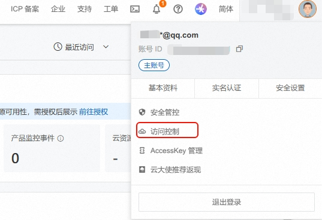
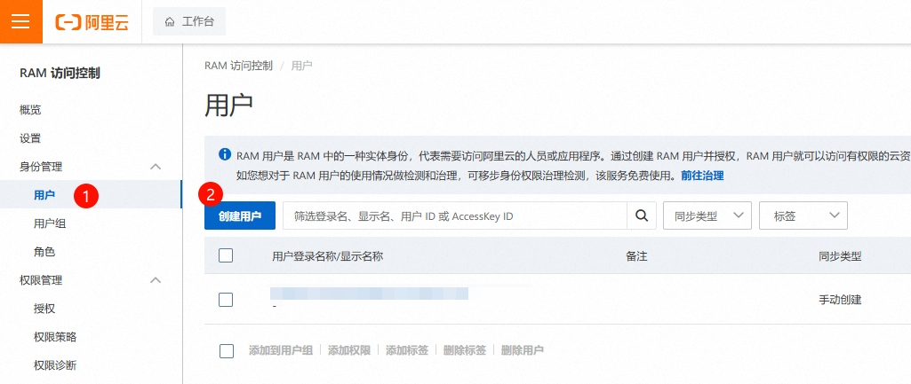
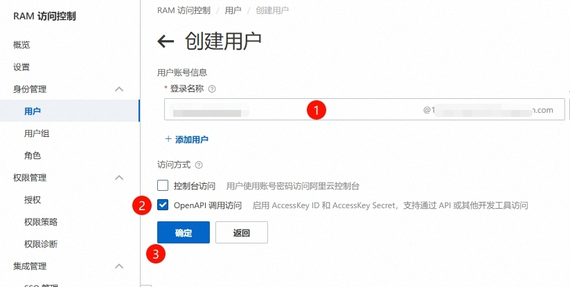
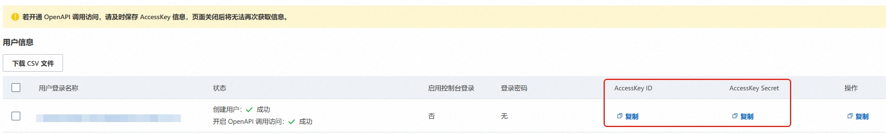
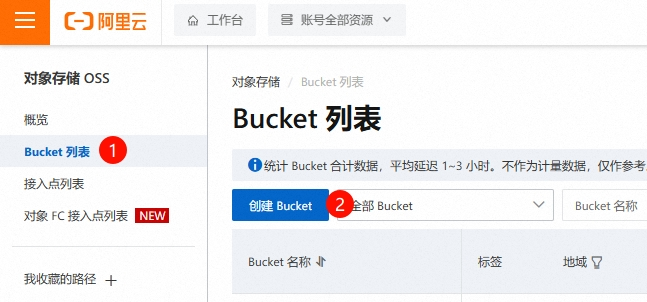
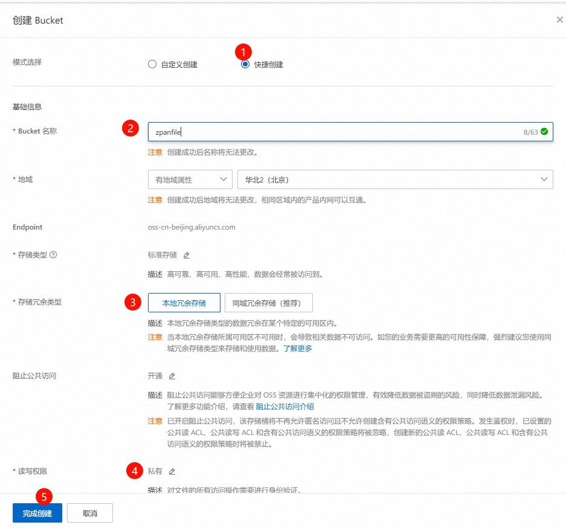
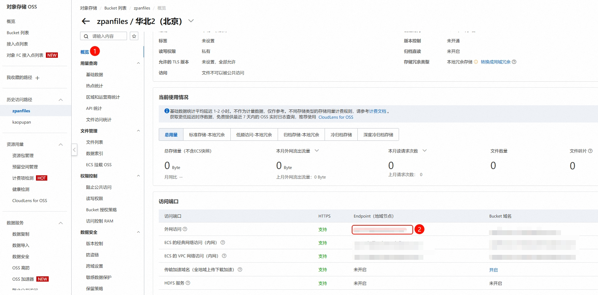
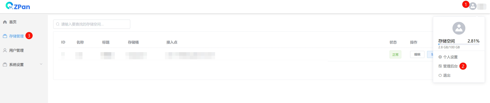

① **登录阿里云，右上角头像选择 ==访问控制==**

② **新建用户**

③ **保存AccessKey ID AccessKey Secret备用**

④ **创建对象存储**

打开阿里云[对象存储](https://oss.console.aliyun.com/)

配置存储桶(Bucket)

进入存储桶,记住Bucket名称(存储桶名称)和Endpoint(地域节点)

⑤ **Zpan创建存储**

登录zpan后，点头像进入管理后台，右上角创建存储，按提示填入信息

> `注意:外链盘可以直接拿到永久外链，同时它没有分享和回收站的功能`

