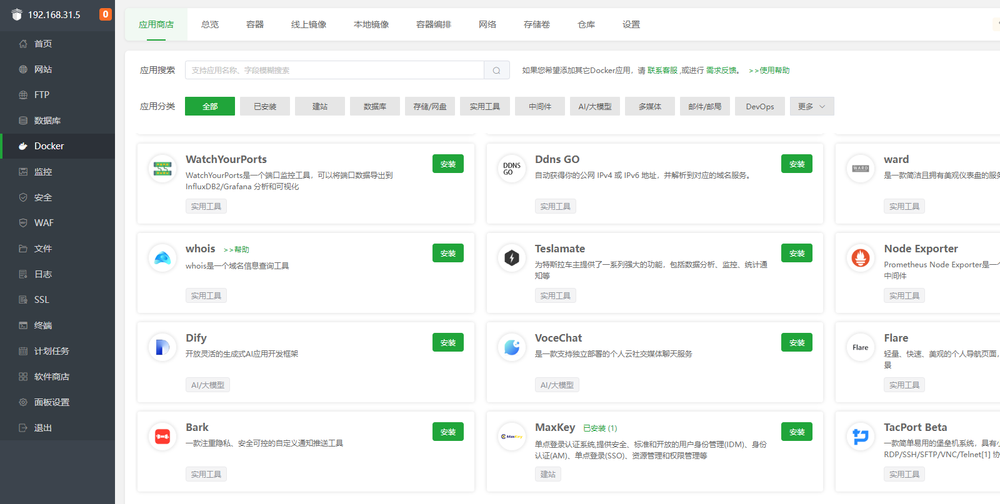

# 使用宝塔面板安装Zpan

## 前提

安装宝塔面板，前往[宝塔面板官网](https://www.bt.cn/u/Z2PlVN)，选择对应的脚本下载安装。

宝塔版本要求：9.2.0+

## 宝塔面板一键部署 Zpan

1. 登录宝塔面板，在菜单栏中点击 Docker，根据提示安装 Docker 和 Docker Compose 服务。

在宝塔面板安装 Docker 服务，若已有则跳过。

2. 在Docker-应用商店查询到 Zpan，点击安装

设置域名等基本信息，点击确定

3. 根据你设置的访问路径进入安装页面(域名地址:8222 / ip地址:8222)。

出现以上页面表示，部署成功，等待进行系统初始化。此时我们需要一个数据库。

## 系统初始化

### 创建数据库

> 已有数据库可跳过此步

在宝塔中创建一个名为zpan的数据库，记住用户名和密码。

### 配置数据库

在安装页面填写对应数据库的信息，我们需要填写一个DSN。MySQL的DSN格式如下：

格式：`数据库用户名:数据库密码@tcp(数据库地址:端口)/数据库名?charset=utf8mb4&parseTime=True&loc=Local`

例子：`user:pass@tcp(127.0.0.1:3306)/zpan?charset=utf8mb4&parseTime=True&loc=Local`

更多数据库详见：[数据库配置](/config?id=dsn)

### 设置管理员账号

设置好管理员账号，点击开始安装即可

如果有报错 请检查 数据库配置信息

### 安装成功

