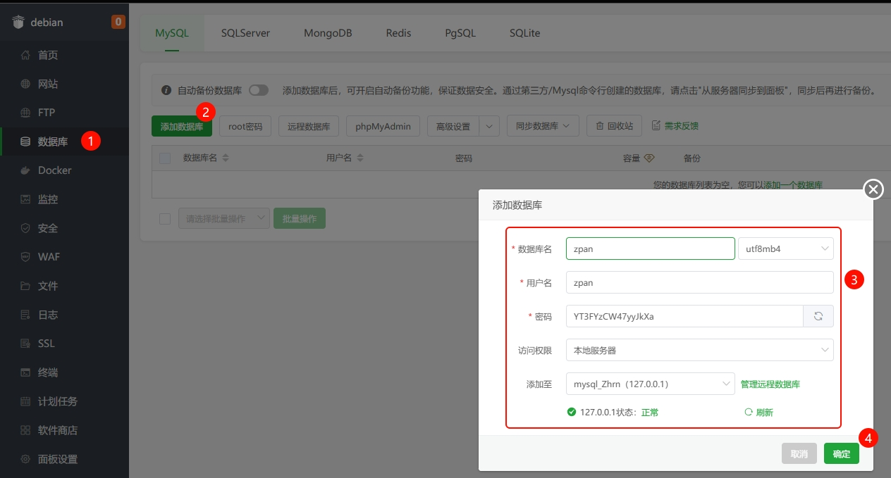

# 项目部署


① 宝塔面板选择Docker菜单

② 输入 zpan

③ 搜索 zpan

④ 点击安装

⑤ 填写配置

⑥ 点击确定，等待部署完成即可


 根据你设置的访问路径进入安装页面(域名地址:8222 / ip地址:8222)
 出现以下页面表示，部署成功

> 教程部署以Docker为例


# 创建数据库
已有数据库跳过此步



# 配置数据库

> 在安装页面选择对应数据库，这里以Mysql为例

###### DSN原文
```bash
user:pass@tcp(127.0.0.1:3306)/zpan?charset=utf8mb4&parseTime=True&loc=Local
```
###### DSN白话文
```bash
数据库用户名:数据库密码@tcp(数据库地址:Mysql端口)/数据库名?charset=utf8mb4&parseTime=True&loc=Local
```


# 设置管理员账号
设置好管理员账号，点击开始安装即可

如果有报错 请检查 数据库配置信息


# 安装成功


